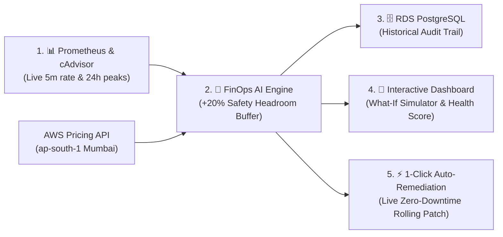
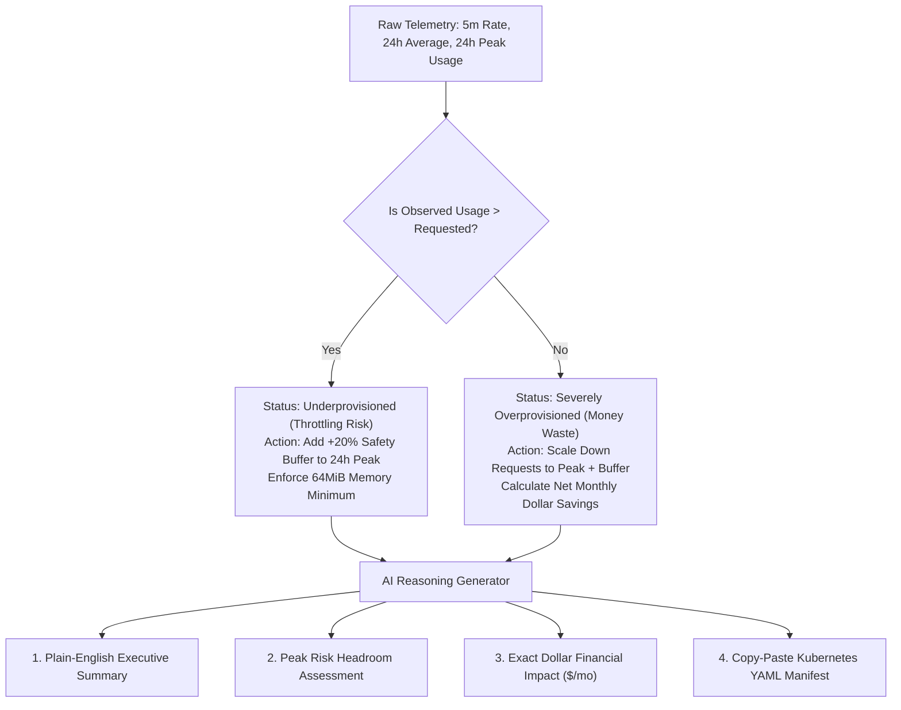

<div align="center">

# ⚡ Cloud-Native Kubernetes Cost Optimizer & FinOps AI Engine

[](https://aws.amazon.com/)
[](https://kubernetes.io/)
[](https://www.terraform.io/)
[](https://fastapi.tiangolo.com/)
[](https://prometheus.io/)
[](https://www.postgresql.org/)
[](https://www.docker.com/)
[](https://github.com/features/actions)

<p align="center">
  <b>An automated, enterprise-grade FinOps platform that continuously reconciles Kubernetes workload resource allocations against live utilization metrics and real-time AWS EC2 Pricing to eliminate cloud waste with zero-risk AI recommendations and 1-click self-healing.</b>
</p>

### 🌐 Live World-Wide Demo
**🚀 [Click Here to Access the Live FinOps Visual Dashboard](https://bit.ly/cloud-k8s-cost-optimizer)**  
*(Interactive Swagger UI: `https://bit.ly/cloud-k8s-cost-optimizer/docs`)*

</div>

---

## 📌 Problem Statement

In modern containerized environments, **over 65% of cloud spend is wasted** due to static, uncalibrated Kubernetes resource requests (`cpu` and `memory`):

1. **💸 The Over-Provisioning Waste**: Developers typically "guess" resource requirements and over-allocate CPU/RAM to stay safe. Because cloud providers bill for reserved node capacity, companies burn thousands of dollars every month on idle compute.
2. **🔥 The Under-Provisioning Outage Risk**: When critical workloads receive insufficient CPU requests, the Linux kernel **throttles** them, causing severe latency spikes. If memory limits are exceeded, containers crash with **OOMKill (Out-Of-Memory)** terminations.
3. **❓ The "Black Box" Attribution Problem**: Multiple microservices share the same EC2 worker nodes, leaving engineering leads blind to the exact dollar cost of individual pods.

---

## 💡 Solution Overview

This platform continuously monitors container utilization via **Prometheus and cAdvisor**, evaluates **24-hour peak traffic spikes**, queries live **AWS EC2 Pricing**, and generates **intelligent right-sizing recommendations**. With its built-in **1-Click Auto-Remediation**, DevOps engineers can patch running pods with zero downtime directly from the web dashboard.



---

## 🛠️ Complete Tech Stack & Why We Used Them

| Technology | Layer | Why We Chose It |
| :--- | :--- | :--- |
| **Terraform (IaC)** | Infrastructure | Declarative provisioning of multi-AZ VPC, EKS cluster, RDS, and ECR with zero configuration drift and 1-command destroy hooks. |
| **Amazon EKS v1.31** | Container Orchestration | Production-grade managed Kubernetes control plane with automated logging and autoscaling worker nodes. |
| **FastAPI (Python 3.11)** | Backend Microservice | Asynchronous, high-throughput REST API with native OpenAPI/Swagger generation and sub-millisecond execution times. |
| **Prometheus & cAdvisor** | Telemetry & Monitoring | Native in-cluster time-series engine that scrapes sub-second CPU and memory vectors directly from worker node Kubelets. |
| **Amazon RDS PostgreSQL** | Persistence & Audit | Fully managed relational database for storing audit logs, historical spend trends, and recommendation telemetry. |
| **AWS Secrets Manager** | Security & Compliance | Stores database credentials securely, eliminating hardcoded passwords across manifests and code. |
| **IAM IRSA (OIDC)** | Cloud Identity | Zero-Trust authentication that binds Kubernetes ServiceAccounts directly to AWS IAM roles without long-lived access keys. |
| **Chart.js & Tailwind CSS** | Frontend Dashboard | Ultra-lightweight, responsive dark-mode dashboard served directly by FastAPI with **< 1MB RAM footprint** ($0 extra servers). |
| **GitHub Actions** | CI/CD Pipeline | Automated 3-stage pipeline enforcing Flake8 linting, Pytest unit tests, Aqua Security Trivy CVE scans, and EKS rollouts. |
| **Docker** | Containerization | Multi-stage, minimal distroless base images optimized for rapid build times and small attack surfaces. |

---

## 🧠 Deep Dive: How AI & FinOps Intelligence is Used

Instead of relying on slow, expensive, and non-deterministic external LLMs that add cloud costs and latency, this platform implements a **Deterministic FinOps AI Reasoning Engine** designed specifically for high-reliability infrastructure:



### 1. 24-Hour Peak Traffic Safety Buffer Formula
To prevent right-sizing from causing outages during sudden traffic spikes, the AI engine evaluates the workload's highest observed spike over the past 24 hours:
$$\text{Recommended CPU (cores)} = \max\left(0.1, \text{Peak 24h CPU} \times (1 + \text{Buffer Multiplier})\right)$$
*(Default buffer is **+20%**, adjustable from 10% to 50% via the interactive dashboard slider).*

### 2. Memory Safety Floor Policy
Even if a lightweight service uses only 0.5 MiB of RAM, the engine enforces a **strict 64 MiB minimum memory floor** (`minimum_memory_policy_mib`) to ensure the Linux container runtime has sufficient headroom during startup and garbage collection.

### 3. Proportional AWS Cost Attribution Math
Calculates the exact fractional dollar share of the host EC2 worker node over a standard 730-hour billing month:
$$\text{Monthly CPU Spend} = \left( \frac{\text{Pod CPU Allocation}}{\text{Host Node Total CPU (2.0)}} \right) \times \text{Hourly AWS On-Demand Rate} \times 730\text{ hours}$$
$$\text{Monthly Savings} = \text{Current Total Spend} - \text{Optimized Total Spend}$$

---

## ⚡ 1-Click Live Auto-Remediation (Self-Healing)

DevOps engineers can right-size workloads instantly without editing YAML files manually.

When the user triggers **`POST /recommendation/apply/{namespace}/{deployment_name}`** (or clicks **`⚡ 1-Click Apply`** in the dashboard):
1. The backend dynamically calculates the optimal CPU and memory requests and limits.
2. Constructs an atomic JSON patch body:
   ```json
   {
     "spec": {
       "template": {
         "spec": {
           "containers": [{
             "name": "backend",
             "resources": {
               "requests": { "cpu": "240m", "memory": "64Mi" },
               "limits": { "cpu": "480m", "memory": "96Mi" }
             }
           }]
         }
       }
     }
   }
   ```
3. Calls `AppsV1Api.patch_namespaced_deployment()` to patch the live deployment baseline.
4. Kubernetes executes a **Zero-Downtime Rolling Update** (spins up new right-sized pods before terminating old ones).
5. The transaction and new resource allocations are logged to PostgreSQL for audit compliance.

---

## 📊 Complete API Reference Table

All endpoints are documented with interactive Swagger docs at **`/docs`**:

| Method | Endpoint | Category | Description |
| :---: | :--- | :---: | :--- |
| `GET` | `/` or `/dashboard` | UI & Health | Renders the interactive, dark-mode FinOps Graphical Web Dashboard. |
| `GET` | `/health` | UI & Health | Kubernetes liveness and readiness probe endpoint. |
| `GET` | `/metrics` | UI & Health | Prometheus exporter endpoint exposing internal Gauges (`k8s_monthly_savings`, etc.). |
| `GET` | `/recommendation/{namespace}/{name}` | FinOps Engine | Computes live right-sizing recommendations, cost breakdown, and AI risk analysis. |
| `POST` | `/recommendation/apply/{namespace}/{name}` | Auto-Remediation | Directly patches live Kubernetes deployment requests/limits with zero downtime. |
| `POST` | `/collect/{namespace}/{name}` | Ingestion | Reconciles metrics against AWS pricing and persists audit records to PostgreSQL. |
| `GET` | `/dashboard/summary` | Analytics | Returns cluster-wide totals: total spend, potential savings, and top spenders. |
| `GET` | `/dashboard/top-savings` | Analytics | Returns top 5 workloads offering the largest cost-reduction opportunities. |
| `GET` | `/dashboard/top-cost` | Analytics | Returns top 5 most expensive workloads running in the cluster. |
| `GET` | `/dashboard/export` | Analytics | Exports all historical recommendation records as a downloadable `.csv` file. |
| `GET` | `/deployments` | Workload Discovery | Discovers all active deployments and their host EC2 instance types across namespaces. |

---

## 🚀 Step-by-Step Deployment Guide

### Prerequisites
* AWS CLI v2 configured (`aws configure`)
* Terraform `>= 1.5.0`
* `kubectl` and `docker`

### 1. Provision AWS Infrastructure (Terraform)
```bash
cd terraform/environments/dev

# Initialize Terraform
terraform init

# Review and deploy (Multi-AZ VPC, EKS v1.31, RDS, ECR)
terraform apply -auto-approve
```

### 2. Connect `kubectl` to EKS
```bash
aws eks update-kubeconfig --name k8s-cost-optimizer-dev-cluster --region ap-south-1

# Verify nodes are Ready
kubectl get nodes
```

### 3. Build & Push Docker Images to ECR
```bash
ACCOUNT_ID=$(aws sts get-caller-identity --query "Account" --output text)
aws ecr get-login-password --region ap-south-1 | docker login --username AWS --password-stdin ${ACCOUNT_ID}.dkr.ecr.ap-south-1.amazonaws.com

cd ~/Desktop/k8s-cost-optimizer-ollama/backend
docker build -t ${ACCOUNT_ID}.dkr.ecr.ap-south-1.amazonaws.com/k8s-cost-optimizer-k8s-cost-optimizer-dev:latest .
docker push ${ACCOUNT_ID}.dkr.ecr.ap-south-1.amazonaws.com/k8s-cost-optimizer-k8s-cost-optimizer-dev:latest
```

### 4. Deploy Kubernetes Manifests
```bash
cd ~/Desktop/k8s-cost-optimizer-ollama

# 1. Fetch DB connection string from AWS Secrets Manager
DB_URL=$(aws secretsmanager get-secret-value --secret-id "k8s-cost-optimizer-dev-db-credentials" --region ap-south-1 --query "SecretString" --output text | jq -r '.DATABASE_URL')

# 2. Create DB secret in optimizer namespace
kubectl apply -f k8s/rbac.yaml
kubectl create secret generic postgres-secret --from-literal=DATABASE_URL="$DB_URL" -n optimizer --dry-run=client -o yaml | kubectl apply -f -

# 3. Apply manifests
kubectl apply -f k8s/prometheus.yaml
kubectl apply -f k8s/backend-deployment.yaml
kubectl apply -f k8s/backend-service.yaml
kubectl apply -f k8s/payment-service.yaml
kubectl apply -f k8s/stress-deployment.yaml
```

### 5. Access the Live Web Dashboard
```bash
# Get the public AWS Load Balancer URL
kubectl get svc -n optimizer k8s-cost-optimizer-service
```
Open the `EXTERNAL-IP` in your browser: `http://<YOUR_LOAD_BALANCER_URL>/`

---

## 🧹 Clean 1-Click Teardown (Zero Leftovers)

To destroy 100% of resources in your AWS account without leaving orphaned ENIs or ECR images:

Terraform destroy

*(Or navigate to `terraform/environments/dev` and run `terraform destroy -auto-approve`).*

---

## 📂 Project Structure

```text
.
├── .github/workflows/
│   └── deploy.yml                  # 3-Stage GitHub Actions CI/CD Pipeline
├── backend/
│   ├── database/                   # SQLAlchemy Models, Session Pooling & Repository
│   ├── services/
│   │   ├── ai_service.py           # FinOps AI Reasoning & YAML Snippet Generator
│   │   ├── cost_analyzer.py        # Proportional AWS Cost Attribution Math
│   │   ├── aws_service.py          # 24h In-Memory AWS Pricing API Cache
│   │   ├── kubernetes_service.py   # K8s API Client & Zero-Downtime Patching Engine
│   │   ├── prometheus_service.py   # cAdvisor Metrics Ingestion & 24h Peak Queries
│   │   └── recommendation_service.py # Core Optimization & Remediation Coordinator
│   ├── templates/
│   │   └── dashboard.html          # Interactive Dark-Mode FinOps Web Dashboard
│   ├── tests/                      # Pytest Test Suite (Analyzer, AI, Remediation)
│   ├── main.py                     # FastAPI Microservice Entrypoint
│   └── Dockerfile                  # Container build specification
├── k8s/                            # Kubernetes Manifests (RBAC, Prometheus, Deployments, Services)
├── terraform/
│   ├── modules/                    # Modular IaC (VPC, EKS, RDS, ECR, IAM IRSA)
│   └── environments/dev/           # Development environment configuration
├── destroy.sh                      # 1-Click automated clean cloud teardown script
└── README.md                       # Enterprise platform documentation
```

---

<div align="center">
  <b>Built by Ansh Mishra</b> &bull; Cloud & DevOps Engineer
</div>
